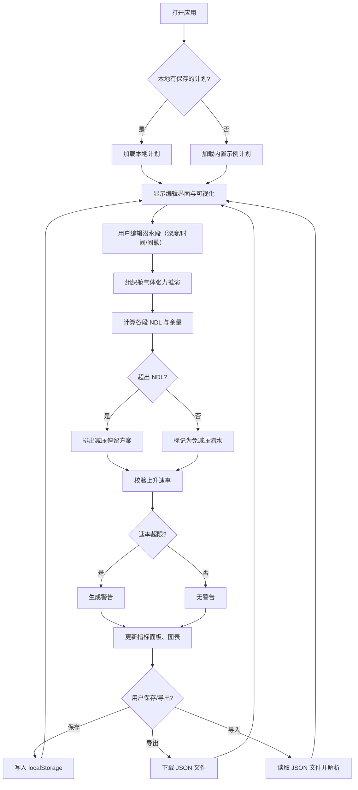

## 1. 产品概述

潜水减压计划工具是一款面向专业潜水教练的浏览器端应用，用于规划多段潜水活动、计算体内惰性气体吸收/排出过程、推演免减压极限与减压停留需求，通过可视化剖面帮助教练安全、科学地制定潜水计划。

- 目标用户：专业潜水教练、技术潜水员
- 核心价值：替代纸质潜水表和经验估算，提供精确的多段潜水气体负荷推演与减压方案
- 解决的问题：多段潜水间残留气体张力衔接容易算错、手工查减压表效率低、缺乏直观的剖面可视化

## 2. 核心功能

### 2.1 用户角色
| 角色 | 注册方式 | 核心权限 |
|------|----------|----------|
| 潜水教练 | 无需注册，直接使用 | 完整规划、编辑、保存、导出、导入潜水计划 |

### 2.2 功能模块
1. **潜水计划编辑器**：多段潜水参数编辑（深度、停留时间、水面间歇）
2. **实时计算引擎**：组织舱气体张力推演、免减压极限（NDL）计算、减压停留排出、上升速率校验
3. **指标与警告面板**：各段 NDL 余量、减压需求、上升速率警告、总潜水时间、气体负荷指标
4. **剖面可视化**：深度-时间曲线、组织舱张力曲线、极限线叠加
5. **数据持久化**：浏览器本地存储、JSON 导入/导出、内置示例计划

### 2.3 页面详情
| 页面名称 | 模块名称 | 功能描述 |
|----------|----------|----------|
| 主页面 | 计划标题区 | 显示计划名称，支持重命名 |
| 主页面 | 潜水段列表 | 多段潜水参数的增删改（目标深度、停留时间、水面间歇） |
| 主页面 | 核心指标面板 | 各段 NDL 余量、是否触发减压、总潜水时间、整体气体负荷 |
| 主页面 | 减压停留列表 | 显示各段所需的减压停留深度和时长 |
| 主页面 | 警告面板 | 上升速率超限、超出安全极限等警告 |
| 主页面 | 深度剖面图表 | 深度随时间变化曲线（含下潜、停留、上升、减压、水面间歇） |
| 主页面 | 组织张力图表 | 各组织舱惰性气体张力随时间变化 + 对应深度的极限线 |
| 主页面 | 工具栏 | 保存到本地、重置为示例、导出 JSON、导入 JSON |

## 3. 核心流程

用户打开页面 → 加载本地存储的计划（或示例数据）→ 编辑潜水段参数 → 系统实时联动重算：气体张力推演 → NDL 计算 → 减压停留排出 → 上升速率校验 → 更新指标、警告、图表 → 用户可保存/导出计划

## 4. 用户界面设计

### 4.1 设计风格
- **主色调**：深海蓝（#0A2540），传达专业潜水的信任与深度感
- **辅助色**：警示橙（#FF6B35）用于危险警告，安全绿（#2EC4B6）用于正常状态，数据紫（#9D4EDD）用于张力曲线
- **按钮风格**：圆角 6px，主按钮深海蓝填充白字，危险按钮橙底白字，次按钮描边
- **字体**：展示字体使用 JetBrains Mono（等宽，适合数据展示），正文字体使用 Source Sans Pro
- **布局风格**：左侧编辑面板 + 右侧图表区的双栏布局，顶部工具栏，卡片式信息块
- **图标风格**：lucide-react 线性图标，配合潜水相关元素（潜水镜、气瓶、波浪等语义）

### 4.2 页面设计概述
| 页面名称 | 模块名称 | UI 元素 |
|----------|----------|----------|
| 主页面 | 工具栏 | 深色背景、品牌标识、图标按钮（保存/重置/导入/导出）、悬停微交互 |
| 主页面 | 潜水段列表 | 编号段卡片、深度/时间输入框（数字步进器）、间歇时间输入、增删按钮、拖拽排序 |
| 主页面 | 指标面板 | 网格布局指标卡、大号数字展示、状态色标签（安全绿/警告橙/危险红） |
| 主页面 | 减压停留列表 | 表格展示深度+时长、属于哪段潜水、状态徽章 |
| 主页面 | 警告面板 | 警告条、图标+文字、可折叠 |
| 主页面 | 深度剖面图 | 深色背景画布、深度轴倒置（越深越靠下）、阶梯状剖面线、减压停留段高亮 |
| 主页面 | 组织张力图 | 多色折线、每条曲线对应一个组织舱、M 值极限线虚线叠加、图例 |

### 4.3 响应式
桌面端优先设计（≥1280px），双栏布局；平板（768-1279px）图表区折到下方；移动端（<768px）单列布局，图表横向可滚动。

### 4.4 动画与交互
- 编辑参数后图表曲线有平滑过渡动画（200ms ease）
- 警告出现时轻微抖动 + 渐入
- 卡片悬停时阴影加深、边框高亮
- 保存/导出成功时按钮微弹跳反馈
