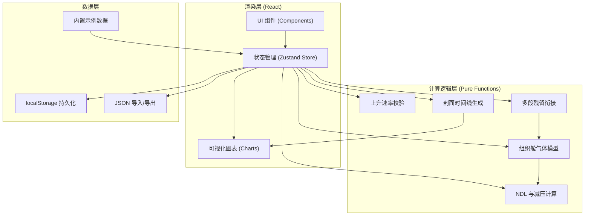

## 1. 架构设计

纯前端单页应用，采用分层架构：计算逻辑层与渲染层严格分离。



## 2. 技术说明

- **前端框架**：React 18 + TypeScript
- **构建工具**：Vite 5（开发端口 6951）
- **样式方案**：Tailwind CSS 3
- **状态管理**：Zustand（轻量、支持中间件持久化）
- **图表库**：Recharts（轻量 React 图表库，支持折线图、面积图、组合图）
- **图标库**：lucide-react
- **测试框架**：Vitest（核心计算逻辑单元测试）
- **后端**：无，纯前端运行
- **数据库**：浏览器 localStorage

## 3. 目录结构

```
src/
├── core/                    # 纯计算逻辑（与 React 完全解耦）
│   ├── types.ts             # 类型定义
│   ├── tissueModel.ts       # 组织舱气体张力模型（Schreiner 方程）
│   ├── ndlCalculator.ts     # 免减压极限与 M 值计算
│   ├── decoCalculator.ts    # 减压停留排出算法
│   ├── ascentValidator.ts   # 上升速率校验
│   ├── multiDive.ts         # 多段潜水残留衔接
│   ├── profileGenerator.ts  # 深度-时间剖面生成
│   └── index.ts             # 统一导出
├── store/
│   └── useDiveStore.ts      # Zustand 状态管理
├── components/
│   ├── Toolbar.tsx          # 顶部工具栏
│   ├── DiveSegmentEditor.tsx # 潜水段编辑
│   ├── MetricsPanel.tsx     # 指标面板
│   ├── DecoStopsList.tsx    # 减压停留列表
│   ├── WarningsPanel.tsx    # 警告面板
│   ├── DepthProfileChart.tsx # 深度剖面图
│   └── TissueTensionChart.tsx # 组织张力图
├── data/
│   └── samplePlan.ts        # 示例潜水计划
├── utils/
│   └── storage.ts           # localStorage & JSON 导入导出工具
├── App.tsx
├── main.tsx
└── index.css
```

## 4. 数据模型

### 4.1 核心类型定义

```mermaid
erDiagram
    DIVE_PLAN {
        string id PK
        string name
        DIVE_SEGMENT[] segments
        number surfaceIntervalAfterLast_min
    }
    DIVE_SEGMENT {
        number id PK
        number targetDepth_m
        number bottomTime_min
        number surfaceIntervalAfter_min
    }
    TISSUE_COMPARTMENT {
        number halfLife_min
        number aMvalue
        number bMvalue
    }
    DIVE_STATE {
        number[] tissueTensions_bar
        number currentDepth_m
        number elapsedTime_min
    }
    DECO_STOP {
        number depth_m
        number duration_min
        number segmentIndex
    }
    CALCULATION_RESULT {
        PROFILE_POINT[] profile
        SEGMENT_RESULT[] segmentResults
        DECO_STOP[] decoStops
        WARNING[] warnings
        number totalDiveTime_min
        number overallGasLoad
    }
    SEGMENT_RESULT {
        number segmentIndex
        number ndlAtStart_min
        number ndlRemaining_min
        boolean requiresDeco
        number maxAscentRate_m_per_min
    }
    PROFILE_POINT {
        number time_min
        number depth_m
        number[] tissueTensions_bar
        string phase
    }
    WARNING {
        string type
        string message
        number severity
        number segmentIndex
    }
```



## 5. 核心算法说明

### 5.1 组织舱模型
采用经典的 Buhlmann ZH-L16C 模型，16 个并行组织舱，每个舱有独立的半排期（half-life）和 M 值系数（a、b）。使用 Schreiner 方程计算压力变化环境下的组织张力：

```
P(t) = P_alv + (P0 - P_alv) * e^(-k*t) + (ΔP/Δt / k) * (1 - e^(-k*t) - k*t*e^(-k*t))
```

### 5.2 免减压极限（NDL）
对每个组织舱，计算其张力达到该深度 M 值所需的时间，取所有舱中的最小值作为 NDL。

### 5.3 减压停留
当某段潜水超过 NDL 时，使用 Buhlmann 算法从最深的减压停留开始逐层上升，每层保证最快组织舱张力 ≤ 该层 M 值。

### 5.4 多段残留
前一段结束时的组织张力数组直接作为下一段的初始状态，水面间歇期间按指数方式脱饱和。

### 5.5 上升速率
休闲潜水标准上升速率 ≤ 9 米/分钟，技术潜水 ≤ 6 米/分钟，超出即警告。

## 6. 测试方案

### 6.1 单元测试覆盖
- `tissueModel.test.ts`：单舱/多舱在恒定深度和变化深度下的张力计算正确性
- `ndlCalculator.test.ts`：典型深度的 NDL 计算与标准潜水表对照
- `decoCalculator.test.ts`：典型超限剖面的减压停留深度/时长正确性
- `multiDive.test.ts`：两段潜水之间残留张力正确传递、水面间歇脱饱和计算
- `ascentValidator.test.ts`：各种上升速率的边界判定
- `determinism.test.ts`：同一输入多次计算结果完全一致

### 6.2 典型测试剖面
1. 单段免减压潜水（30m/25min）→ 验证 NDL 余量正常
2. 单段减压潜水（40m/30min）→ 验证减压停留正确排出
3. 两段潜水（30m/20min → 水面1h → 25m/25min）→ 验证残留张力导致第二段 NDL 缩短
4. 快速上升剖面 → 验证速率警告触发
